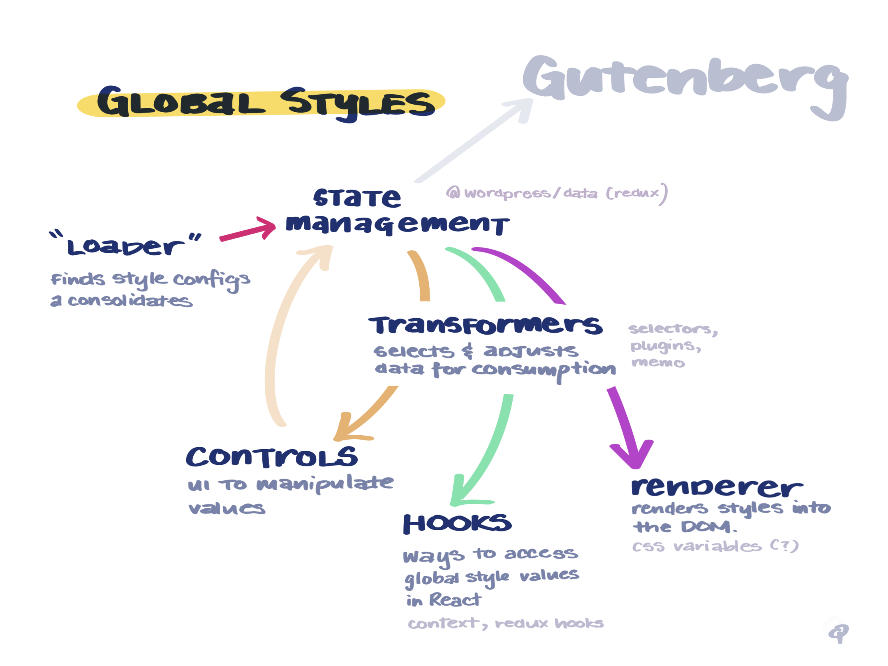

# Gutenberg - Global Styles

## Concept ✨

Global styles is a system makes it easier for users to reliably design and stylize their sites. It provides a foundation for Gutenberg Blocks, Themes, and Customizations to work together.

## Demos

-   **[Demo of Mechanics](https://yvz8y.csb.app/#/i2)**
-   **[Style Hierarchy Visualization](https://yvz8y.csb.app/#/v2)**

## Mechanics

The primary mechanics of Global styles are:

-   "Loader"
-   State Management
-   Transformers
-   Controls
-   Hooks
-   Render

### Loader

Loader interacts with a **theme** by first finding a `theme.json`. This `.json` file contains configurations ([Design Tokens](https://css-tricks.com/what-are-design-tokens/)) that stylize the site.

### State Management

Gutenberg uses a heavily modified version of [Redux](https://redux.js.org/) in their [@wordpress/data](https://github.com/WordPress/gutenberg/tree/master/packages/data) package. Global styles' state management will be part of this data store. This allows the global styles data to be accessed, shared, and manipulated across all of Gutenberg. From a Global Styles Editor, to individual blocks.

### Transformers

Transformers [immutably](https://en.wikipedia.org/wiki/Immutable_object) adjust the data from the store, making it easier to consume. Global styles expose a transformers plugin system, allowing for the data to be modified or interpolated to generate more values.

For example, a single colour value, auto-generating 6 colour variants.

### Controls

Controls exist within the Global Styles editor. They provide a UI (e.g. range sliders, colour pickers) that allow the user to directly manipulate global style values. This experience replicates that of [`InspectorControl`](https://github.com/WordPress/gutenberg/tree/master/packages/block-editor/src/components/inspector-controls) from [`@wordpress/components`](https://github.com/WordPress/gutenberg/tree/master/packages/components), which is the current established pattern from updating blocks within Gutenberg.

### Hooks

(Custom) [Hooks](https://reactjs.org/docs/hooks-reference.html) allow for Gutenberg blocks to have access to global styles. These hooks should feel very light weight to use. Most of the heavily lifting of accessing, consolidating, and transforming data will be handled by the "Transforms" mechanic.

### Renderer

The Renderer outputs the global styles (prepared by Transformers) into the DOM, for both Gutenberg editor (block "edit") and the "frontend" of the site (block "save").

Within Gutenberg, anytime a custom style (global, document or block) is updated, the Renderer needs update the styles in real time.

For "frontend" site rendering, it is preferred that there is no style computation/consolidation required on runtime. This can be accomplished by pre-saving a generated HTML output during editing.

The desired implementation is to use [CSS Variables](https://developer.mozilla.org/en-US/docs/Web/CSS/Using_CSS_custom_properties), which gives us native interpolation and scoping features.

However, potential alternatives may include working directly with a [CSSStyleSheet instance](https://developer.mozilla.org/en-US/docs/Web/API/CSSStyleSheet), a managed CSS className system, or anything in between.

---

## Inspirations

### State Management, Transforms, Renderer

Inspiration for these mechanics come from the internals of popular CSS-in-JS libraries like [Emotion](https://github.com/emotion-js/emotion).

Internally, most of these libraries use [Stylis](https://github.com/thysultan/stylis.js) for CSS pre-processing. Stylis has a plugin system, allowing for authors to customize style output as required. This feature inspired the plugin system for **Transformers**.

The way libraries like Emotion coordinate style updates + re-renderings inspired some of the ideas within the **State Management** and **Renderer** mechanics.

### Style Hierarchy

The Style Hierarchy of Core, Themes, Global, Document, Blocks was inspired by the "Inverted Triangle" design principle from [ITCSS](https://www.xfive.co/blog/itcss-scalable-maintainable-css-architecture/).

Some of the borrowed concepts focus on style layering and the unidirectional flow of specifity (overrides).
