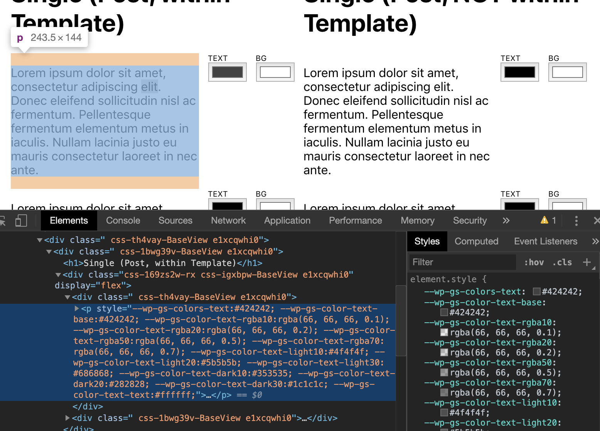
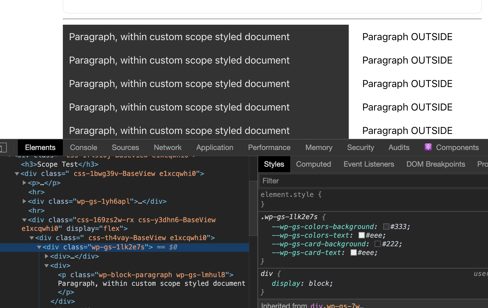
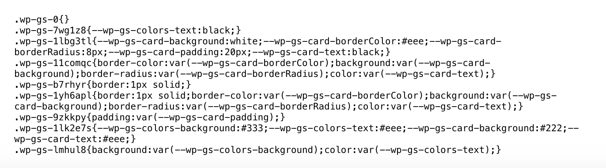
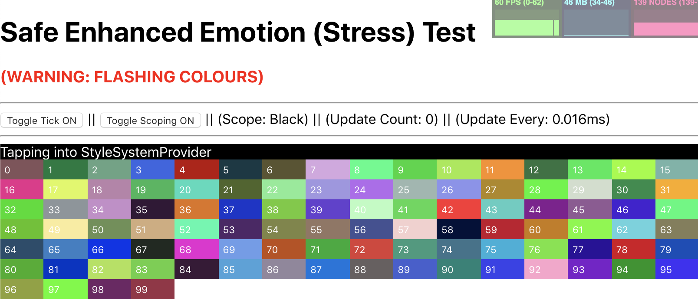

# Renderer Experiments

This effort was designed to discover and streamline how blocks can declare and render style properties. It also focused on the underlying non-user facing mechanics necessary to handle those features.

## Global Style Manager

Previously, the Renderer injected the global style values as inline CSS variables. This technique works, with 3 downsides:

1. Inline styling, raises specificity, which slightly the cascade flow of CSS (even if it's CSS variables)
2. It takes a [performance hit](https://lisilinhart.info/posts/css-variables-performance), especially as the number of styles x blocks increases.
3. It bloats the DOM



To resolve this, we need to combine all of the style properties to a single entity, a CSS className, and apply that instead of inline styling.

To do this, we will need:

-   a cache of some kind
-   something to compile styles
-   something to hash

The above mechanics would translate something like:

```
{
    colors: {
        text: 'red'
    }
}
```

Into:

```
.wp-gs-h21dlja
```

The **important** part is. The hash **must** stay 100% consistent with the input. In the above example, the `Object` input will always result `.wp-gs-h21dlja` due to it's value. This ensures that styles never go out of sync, regardless of when/how they render.

To accomplish this, I've decided to try leverage [create-emotion](https://github.com/emotion-js/emotion/tree/master/packages/create-emotion). It provides all of the necessary parts, saving me from writing my own.

With that in place, we can achieve a result that looks like this:



With a complete `HTML` CSS style output of:



This can be injected/rendered on the **front-end** of a WordPress site.

## Registering/Rendering the local block styles

## Stress Testing



[Click here to see the GIF](https://d.pr/i/FFORX4)
(Warning: Flashing Colors)
