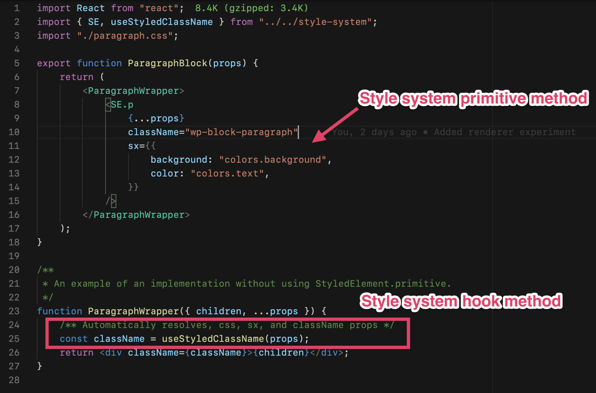

# Renderer Experiments

This effort was designed to discover and streamline how blocks can declare and render style properties. It also focused on the underlying non-user facing mechanics necessary to handle those features.

## Demo

**[Link to Demo](https://yvz8y.csb.app/#/r1)**

## Global Style Manager

Previously, the Renderer injected the global style values as inline CSS variables. This technique works, with 3 downsides:

1. Inline styling, raises specificity, which slightly the cascade flow of CSS (even if it's CSS variables)
2. It takes a [performance hit](https://lisilinhart.info/posts/css-variables-performance), especially as the number of styles x blocks increases.
3. It bloats the DOM


To resolve this, we need to combine all of the style properties to a single entity, a CSS className, and apply that instead of inline styling.

To do this, we will need:

-   a cache of some kind
-   something to compile styles
-   something to hash

The above mechanics would translate something like:

```
{
    colors: {
        text: 'red'
    }
}
```

Into:

```
.wp-gs-h21dlja
```

The **important** part is. The hash **must** stay 100% consistent with the input. In the above example, the `Object` input will always result `.wp-gs-h21dlja` due to it's value. This ensures that styles never go out of sync, regardless of when/how they render.

To accomplish this, I've decided to try leverage [create-emotion](https://github.com/emotion-js/emotion/tree/master/packages/create-emotion). It provides all of the necessary parts, saving me from writing my own.

With that in place, we can achieve a result that looks like this:


With a complete `HTML` CSS style output of:


This can be injected/rendered on the **front-end** of a WordPress site.

## Using Styles in Blocks



My goal was to make it as simple as possible to use/reference global styles. This resulted in 2 techniques:

1. A `StyledElement` primitive set
2. A `useStyledClassName` hook
3. Traditional CSS

### StyledElement

The `StyledElement` primitive has all of the React support HTML elements (e.g. `div`, `a`, `p`, etc...). However, it's been enhanced with the ability to reference global style values via the `sx` property.

Under the hood, the `StyledElement` is a convenient wrapper for the `useStyledClassName` hook.

This pattern follows the specifications outlined by [Theme UI](https://theme-ui.com/getting-started).

### useStyledClassName

This special hook consolidates incoming `className` with global style referencing via the `sx` prop. It communicates with the Global Style Manager to either use a previously cached hash className, or to generate + register a new one.

### Traditional CSS

We can still use traditional CSS to style these blocks. This pattern, although not as interconnected, should be supported due to workflow familiarity. To use a global style variable, the variable convention of `var(--wp-gs-myGlobalStyleVariable)` can be used.

## Stress Testing


**[Link to Stress Test Demo](https://yvz8y.csb.app/#/r1-stress)**

[Click here to see the GIF](https://d.pr/i/FFORX4)
(Warning: Flashing Colors)

To test the performance of the Global Style Manager, I created a stress test (link above).

The test regenerates a unique className for every square every 16ms. I've added some performance visuals (top right) to detect FPS (dropped frames) and memory leaks.

Within a couple of seconds, we would have generated over **10,000** unique CSS classNames. Typical Gutenberg usage will probably **never** acheive the same generation velocity.

The system can handle 10,000 classNames without breaking a sweat. It's when we start reaching 15,000+ that it starts slowing down.

Again, the load is exacerbated by the rate (regen ever 16ms, or 60 times a second).

If we slow it down to an update every 100ms (10 times a second), it can reach **45,000** unique CSS classNames before slowing down:


It is **highly unlikely** that the site would ever need that many DOM nodes, let alone classNames. If anything, the browser would most likely become sluggish/crash once the DOM node count surpasses 7000.

## Conclusion

I think leveraging a Global Style Manager of some kind to coordinate the rendering, caching, compiling, and hashing of block styles will be useful! I'm pretty confident of this.

My next test would be to try this out within an actual WordPress/Gutenberg install.
